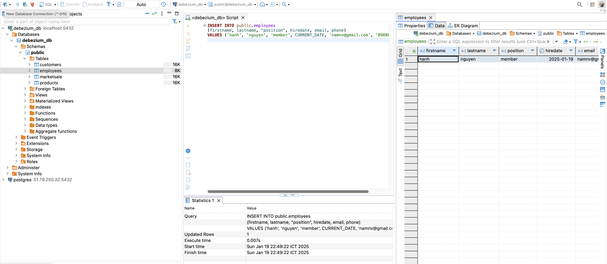

# CDC: Comprehensive Guide- PostgreSQL To S3(MinIO) Using NiFi

## Introduction

This project delves into leveraging CDC for PostgreSQL databases using Debezium, orchestrating data processing through NiFi, and subsequently storing the processed data in MinIO, a high-performance S3-compatible storage solution.

### Project Overview
For this project, we used Debezium to capture real-time data from a PostgreSQL database that mimicked the basic needs of e-commerce marketing.
Debezium automatically wrote changes to Kafka topics, enabling data integration while maintaining data accuracy and performance.
MinIO stored processed data as an S3-compatible object storage solution. This architecture makes data accessible in real-time for analysis and stores advanced storage and analysis capabilities by adding tools like Iceberg or Delta Lake. This architecture enabled systems to respond quickly and take advantage of downloading data.

 

## Prerequisites
- Docker-Docker Compose
- Debezium
- Kafka
- KafkaUI
- NiFi(1.27)
- MINIO

## Setup

```sh
git clone https://github.com/burakugurr/cdc-postgresql_to_minio.git
cd cdc-postgresql_to_minio/Docker
docker compose up
```

## Apache Nifi Template

- Download CDC_latest.cml file. 
- Import template from nifi ui.





message in kafka topic


SQL insert query for test

```
INSERT INTO public.employees
(firstname, lastname, "position", hiredate, email, phone)
VALUES ('hanh', 'nguyen', 'member', CURRENT_DATE, 'namnv@gmail.com', '0988888888');
```


# How to custom key of kafka messages

## 1. create connnector to DB

```
curl --location 'http://localhost:8083/connectors' \
--header 'Content-Type: application/json' \
--data '{
  "name": "my-postgres-connector",
  "config": {
    "connector.class": "io.debezium.connector.postgresql.PostgresConnector",
    "database.hostname": "postgres",
    "database.port": "5432",
    "database.user": "debezium_user",
    "database.password": "debezium_pass",
    "database.dbname": "debezium_db",
    "database.server.name": "pgserver1", 
    "slot.name": "debezium_slot",
    "plugin.name": "pgoutput",

    "topic.prefix": "mydb",

    "key.converter": "org.apache.kafka.connect.json.JsonConverter",
    "key.converter.schemas.enable": "false",
    "value.converter": "org.apache.kafka.connect.json.JsonConverter",
    "value.converter.schemas.enable": "false",

    "table.include.list": "public.employees",

    "message.key.columns": "public.employees:employeeid,firstname",
    "message.key.columns.include": "ALL"
  }
}
'
```

## 2. recheck connector

```
curl --location 'http://localhost:8083/connectors/my-postgres-connector/status'
```

Delete if need
```
curl --location --request DELETE 'http://localhost:8083/connectors/my-postgres-connector'
```

## 3. Reload db

Example is portgres

```
SELECT pg_reload_conf();
```

output


